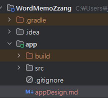

# Task 3: 영어 단어장 앱 만들기 (Part 1) 

## Use case: 
- 영어 단어장 앱을 만들어 보며, GitHub Copilot의 다양한 기능을 활용하는 방법을 익힙니다.

## 목표:
- 실제 영어 단어장 앱을을 빌드하면서 GitHub Copilot의 다양한 기능을 활용하는 방법을 익힙니다.
- 기본 GPT-4o 모델 외에, 다른 모델을 활용해 봅니다. 
- @project를 활용하여 질문에 대해 Copilot이 프로젝트 전체에서 관련된 파일들을 참조하는 방법을 익힙니다.
- Copilot Edits 기능을 활용하여 더욱 편리하게 GitHub Copilot을 사용할 수 있는 방법을 익힙니다.

## Step 1: 앱 설명

###  WordMemoZzang - 영어단어장 애플리케이션
- 영어단어장 애플리케이션

- 주요 기능
	- 사용자 로그인 및 회원가입.
	- 영어 단어 리스트 목록 조회
	- 영어 단어 추가 기능

### 앱 구성요소 

- Java 기반 Android 애플리케이션

- 데이터 베이스
   - SQLite
   - Room Database
   - Repository: 데이터 소스와 View 간의 중재자 역할을 하여 데이터의 흐름을 관리.

- Model
   - Word: 영어 단어 정보를 저장하는 모델. 
   - 스키마: 단어, 뜻, 예문, 생성 시간, 수정 시간

- Firebase Authentication을 사용하여 사용자 인증을 처리.

- 단일 Activity 아키텍쳐로 navigation component를 사용하여 화면 전환을 관리.
   - 메인화면: Login/Register 사용자 로그인 및 회원가입 화면.
   - Word List : 로그인 후 단어 리스트 화면. RecyclerView를 사용하여 단어 목록을 표시.
   - Word Add : 단어 추가 화면.

## Step 2: 프로젝트 시작

- New Project를 선택하고 '`Basic Views Activity`'를 선택합니다.  
  

- 프로젝트 이름을 설정하고, Java를 선택하여여 시작합니다.  
  

- Copilot Chat에서 모델을 변경합니다. Claude 3.7 Sonnet 모델을 선택합니다.  
  

- 프로젝트에 새로운 파일을 추가하고, 위 '1.앱 설명'의 내용을 복사하여 붙여 넣는다.  
  
  
  

- Copilot Chat창에서 '+' 버튼을 눌러, 위 생성된 `appDesign.md` 텍스트 파일을 추가하고, 이 프로젝트를 구성하기 위한 절차를 제안해 달라고 요청 해봅니다.  
  
  

- Copilot이 제안해 주는 내용을 확인합니다.  
    
    
    
    
    

- `appDesign.md` 파일을 바탕으로 UML 다이어 그램을 작성해 달라고 요청해 봅니다.  
    
    

  - 생성된 내용을 새로운운 puml 파일로 저장하고 확인합니다.  
    

## Step 3: 의존성 설정 

- **Copilot Edit** 모드로 이동합니다.  
    

- Chat창에서 '+' 버튼을 누르고, `build.gradle`, `libs.versions.toml` 파일을 추가합니다.   
  (만약 '+' 버튼을 눌러 파일이 보이지 않는다면, 해당 파일을 더블 클릭하여 오픈합니다. 혹은 원하는 파일을 드래그하여 채팅창으로 끌어옵니다.)  )

    
    

- Copilot Edit 에 `Room 의존성을 추가해줘` 와 같이 요청합니다.  
    
    

- 파일을 눌러 변경 내역을 확인합니다.  
    
    

- 'Accept All' 버튼을 클릭하여 제안된 내용을 모두 적용합니다.  
    

- 'Sync now' 버튼을 클릭하여 의존성을 설정합니다.  

- 위와 동일하게 `Firebase authentication 의존성을 추가해줘`라고 요청하여 의존성을 추가 합니다.  
  - 'Sync now' 버튼을 클릭하여 의존성을 설정합니다.  

- Navigation Component 의존성을 추가합니다.  
  - Copilot Edit에서 `Navigation Component 의존성을 추가해줘`라고 요청합니다.  
  - 'Sync now' 버튼을 클릭하여 의존성을 설정합니다.  

## Step 4: Firebase 설정
- Firebase Console에 접속하여, 새로운 프로젝트를 생성합니다.  
    
    

- Analytics 사용하도록 설정합니다.  
    
    

- Android 앱을 추가합니다.  
    
  
- SHA-1 인증키를 추가하기 위해, 터미널 창을 열고 루트 디렉토리에서 아래 명령을 실행 합니다.  
  - `.\gradlew signingReport`   (윈도우)
    
    

  - SHA-1 인증키를 복사하여 Firebase Console에 붙여넣고 '앱등록' 버튼 클릭릭.  
    

- 설정 파일 `google-services.json`을 다운로드 받아, `app` 디렉토리에 추가합니다.  
    
    

- Firebase SDK를 추가합니다.  
  - 이 부분은 위 의존성 설정 과정에서 이미 추가되었기 때문에 확인만 합니다.  
    

- Firebase Authentication을 설정합니다.
  - Firebase Console에서 왼편의 '빌드' 메뉴의 `Authentication` 을 선택합니다.  
    
  - '로그인 방법'에서 `이메일/비밀번호`를 활성화 합니다.  
    
    

## Step 4: 데이터 베이스 설정

- 계속해서 **Copilot Edits** 기능을 활용하여, 데이터베이스를 설정합니다.  

- Copilot Edit에서 우측의 'clear Working Set' 버튼을 클릭하여, 현재 working set에 추가되어 있는 파일들을 제거 합니다.  
    

- Copilot Edits 채팅창에서 다시 '+' 버튼을 클릭하고, 위에서 생성된 `project.txt` 텍스트 파일을 추가하고 아래와 같이 입력하여 데이터 베이스 설정을 요청합니다.  
  - `이 프로젝트를 위한 Word Entity 클래스, DAO인터페이스와 RoomDatabase 클래스를 현재 app경로(com.keon.wordmemozzang)에 생성해줘`.  
    

- Copilot Edits가 제안한 내용을 확인합니다.  
    

- `Accept All` 버튼을 클릭하여 제안된 내용을 모두 적용합니다.  

## Step 5: 저장
- File 메뉴의 `Save All`을 통해 현재까지 구성을 저장합니다.  

