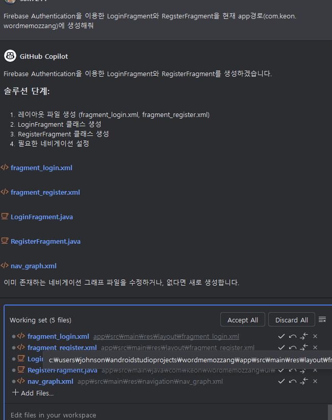
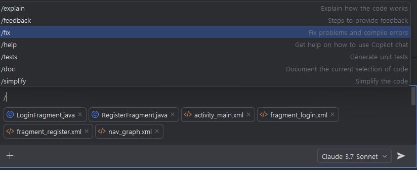

# Task 4: 영어 단어장 앱 만들기 (Part 2) 

## Use case: 
- Part 1에서 생성된 영어 단어장 앱에 Copilot을 활용해 나머지 기능을 구현하며, 빌드시 발생되는 에러, 디버깅 실행을 하며 발생되는 에러등을 `@project` 를 통해 Copilot의 도움을 받으며 해결하며 앱을 완성 합니다. 테스트 코드를 작성하고, 앱을 빌드하여 실제로 동작하는지 확인합니다.

## 목표:  
- Copilot Agent를 활용하여, 영어 단어장 앱의 나머지 기능을 구현합니다. 
- Copilot chat에서 '/'를 입력하고 /fix를 통해 에러 메세지를 붙여넣고 문제 해결을 요청해 봅니다. 
- `@project` 를 통해 Copilot의 도움을 받으며 에러를 해결합니다.
- 디버깅 실행 후 모바일 화면의 에러를 화면 캡쳐하고 이미지를 통해 Copilot에게 문제 해결을 요청합니다.

## Step 1: 로그인/회원 가입 기능 구현
- 로그인 및 회원 가입 기능 구현을 위해, Firebase Authentication을 이용한 LoginFragment와 RegsterFragment의 생성을 Copilot에게 요청합니다.  
  - `Firebase Authentication을 이용한 LoginFragment와 RegsterFragment을 현재 app경로(com.keon.wordmemozzang)에 생성해줘`  
    

- 제안 내용을 확인하고, 'Accept All' 버튼을 눌러 제안된 내용을 유지합니다.  
  - 아래와 같이 Fragment들과 함께 Layout XML 파일과 nav_graph까지 함께 생성/수정되었습니다. (단, 아래는 실제 실습 상황에서 다르게 제안될 수 있습니다)   
    
    

- 실습에서 만약 Layout XML 파일이 함께 생성되지 않았다면, 별도로 아래와 같이 생성합니다.  

- 로그인/회원 가입 화면 구현을 위해, Copilot에게 요청합니다.  
  - `위에서 생성된 LoginFragment와 RegsterFragment의 UI를 구현해줘`  

## Step 2: 단어 목록 화면 구현하기
- 로그인 후, 단어 목록 화면 구현을 위해, Copilot에게 아래와 같이 요청합니다.  
  - `사용자 로그인 후, 단어 목록 화면을 표시할 WordListFragment를 구현해 줘. WordList는 RecyclerView를 사용해 목록을 표시해줘`  
    

- 제안된 내용을 확인하고, 'Accept All' 버튼을 눌러 제안된 내용을 유지합니다.  
  - 아래와 같이 Fragment, Word ViewModel과과 함께 Layout XML 파일과 nav_graph까지 함께 생성/수정되었습니다. (단, 아래는 실제 실습 상황에서 다르게 제안될 수 있습니다)   
    
    

## Step 4: 단어 추가 화면 구현하기
- 단어 추가 화면 구현을 위해 Copilot에게 아래와 같이 요청합니다.  
  - `단어 추가 화면을 위한 WordAddFragment를 구현해 줘`  
    
    

## Step 5: Navigation 설정 및 화면 전환
-  현재 제안된 Navigation 그래프를 확인하고 수정이 필요한 부분을 Copilot Edit에게 요청합니다.  
    

- 디버그 모드에서 화면 전환이 잘 되는지 확인합니다.  
    
    
    
    

## Step 6: 빌드와 디버그 모드 실행하고 에러 수정하기

- 문제 발생 시, Copilot chat에서 `/fix`를 입력하고, 에러 메세지를 붙여넣고 문제 해결을 요청합니다.  
   
   
   

- 화면이 정상적으로 표시되지 않는 문제등에 대해, 화면 캡쳐를 통해 Copilot에게 문제 해결을 요청합니다.  
  - 화면 캡쳐를 파일로 저장하고 '+' 버튼을 클릭하여 이미지를 추가합니다.  
   
   
   

- 에러 수정에 `@project`를 활용하여 수정이 필요한 부분들을 확인하고, Copilot에게 수정을 요청청합니다. 

