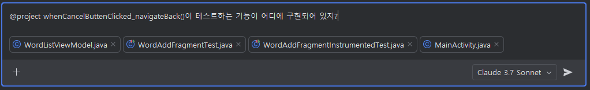

# Task 5: Test코드 작성

## Use case: 
- Copilot에게 Test code를 제안 받습니다.

## 목표:
 - Copilot Edit 혹은 Agent 모드드를 활용하여, 유닛 테스트와 계측 테스트 코드 생성을 실습합니다.
 - 저장소의 변경 사항을 커밋할 때, GitHub Copilot을 활용하여 커밋 메세지를 자동으로 생성합니다.
 
## Step 1: 유닛 테스트 코드 작성
 - 아래와 같이 WordAddFragment의 `validateAndSaveWord` 메서드를 테스트하는 유닛 테스트를 작성하도록 요청합니다. <br>
  `(프롬프트 예시)`
  ```
  WordAddFragment의 validateAndSaveWord 메서드를 테스트하는 아래 시나리오들에 대해 유닛 테스트 코드를 작성해줘.
	1. 단어 입력이 비어있는 경우 오류 메시지 표시 및 단어 저장 안 됨
	2. 의미 입력이 비어있는 경우 오류 메시지 표시 및 단어 저장 안 됨
	3. 모든 입력이 유효한 경우 단어가 저장되고 목록 화면으로 이동

	필요한 의존성(ViewModel, NavController 등)은 Mockito로 모킹해줘.
  ```

   <br>

  - 제안된 내용을 확인하고, 'Accept All' 버튼을 눌러 제안된 내용을 유지합니다. <br>

   <br>
   <br>
  - 테스트를 실행하여 결과를 확인하고 발생된 에러 수정을 위해 `/fix`를 통해 Copilot에 문의 합니다. <br>
   <br>
   <br>
   <br>

  <br>
  

 
## Step 2: 계측 테스트 코드 작성

- 아래 예시시와 같이 계측 테스트 코드를 작성하도록 요청합니다. <br>
`(프롬프트 예시)`
```
WordAddFragment 클래스에 대한 AndroidX 계측 테스트를 작성해줘줘. 

1. ActivityScenarioRule을 사용하여 프래그먼트를 실행하는 MainActivity를 시작
2. Espresso를 사용하여 다음 테스트 케이스 작성:
   - 단어 입력 필드가 비어 있을 때 저장 버튼을 누르면 에러 메시지가 표시되는지 확인
   - 의미 입력 필드가 비어 있을 때 저장 버튼을 누르면 에러 메시지가 표시되는지 확인
   - 단어와 의미가 입력되었을 때 저장 버튼을 누르면 WordListFragment로 이동하는지 확인
3. 필요한 모든 매칭 패턴과 액션 사용
4. 테스트에 필요한 모의 객체 설정(예: ViewModel)
```
- 제안된 내용을 확인하고, 'Accept All' 버튼을 눌러 제안된 내용을 유지합니다. <br>
   <br>

- 테스트를 실행하여 결과를 확인하고 발생된 에러 수정을 위해 @project, /fix를 활용해해 Copilot에 문의 합니다. <br>
   <br>
   <br>
   <br>


## Step 3: Git commit 메세지 자동 생성
- 저장소의 변경 사항을 커밋할 때, 아래와 같이 Copilot 아이콘을 클릭하여 커밋 메세지를 자동으로 생성해 봅니다. <br>
   <br>
   <br>


## 추가자료
- [GitHub Copilot을 활용한 Unit test생성 사용예](https://github.blog/ai-and-ml/github-copilot/how-to-generate-unit-tests-with-github-copilot-tips-and-examples/)