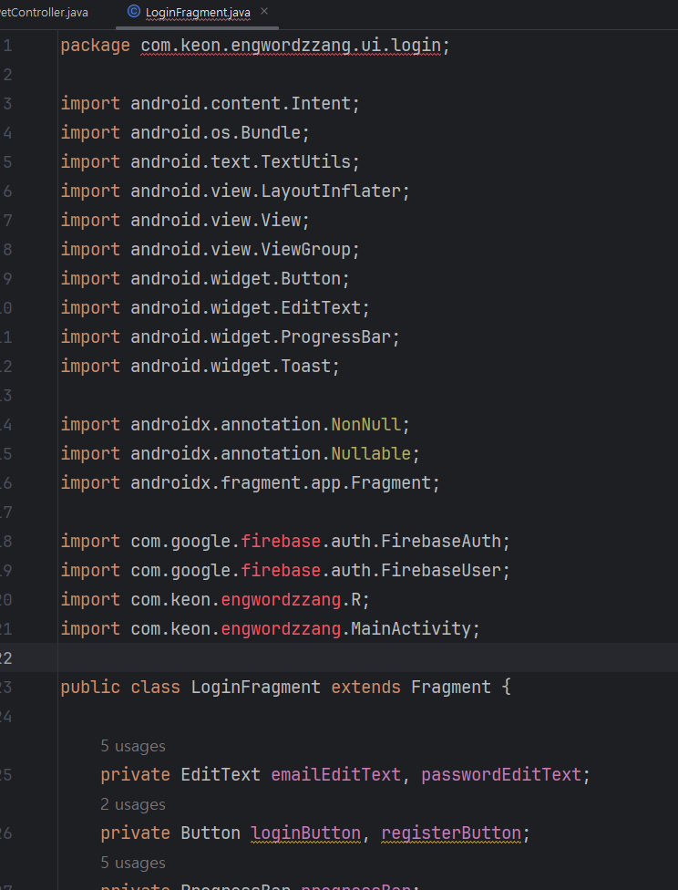
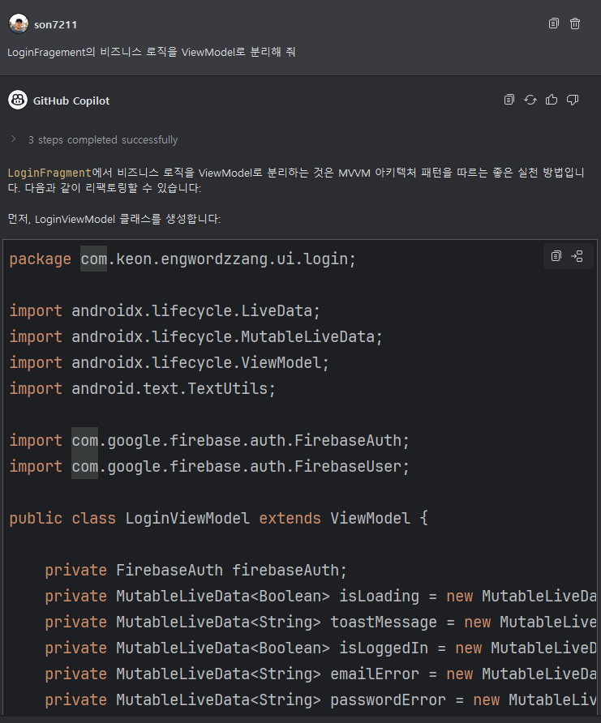
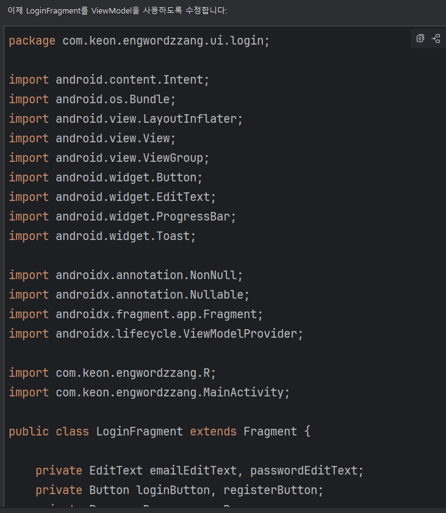
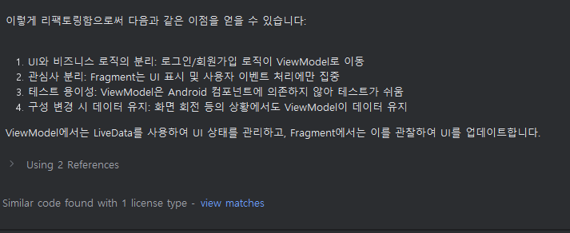
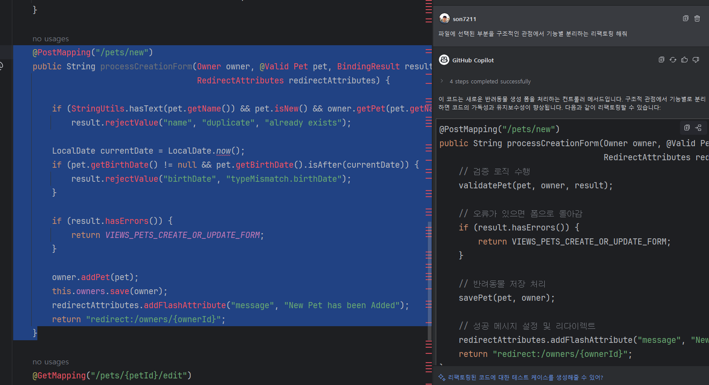
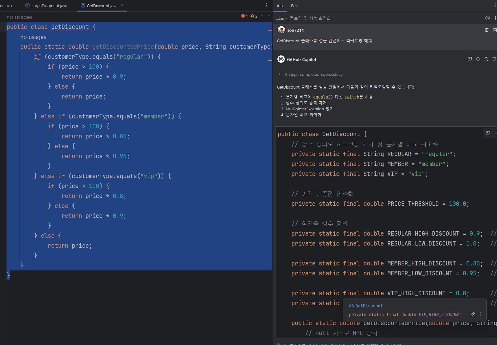
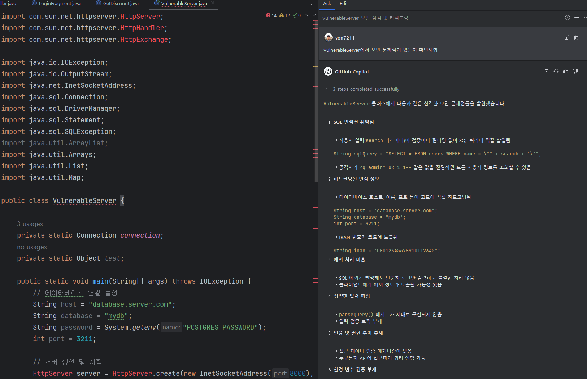

# Task 6: 코드 리팩토링, 보안 문제 확인

### Use case: 
- GitHub Copilot를 활용하여 코드 리팩토링을 진행합니다.

### 목표:
- GitHub Copilot Chat을 활용해 코드를 리팩토링 하는 예제를 실습합니다.
- GitHub Copilot Chat을 활용해 문제점을 찾고, 해결 방법을 제안 받습니다.

## Steps:
- [LoginFragment.java](src/LoginFragment.java) 파일에 있는 비즈니스 로직(로그인, 회원가입, 유효성 검사)을 ViewModel로 분리하도록 요청합니다. 
  - 프롬프트 예시 : `LoginFragment 파일의 비즈니스 로직을 ViewModel로 분리해줘`  
    
    
    
    

- [PetController.java](src/PetController.java) 파일의 `99-119 라인` 블럭을 선택하고, GitHub Copilot Chat에 리팩토링을 요청합니다.
  - 프롬프트 예시 : `구조적인 관점에서 기능별 분리하는 리팩토링 해줘`
    

- [getDiscoun.py](src/GetDiscount.java) 파일을 선택하고, GitHub Copilot Chat에 리팩토링을 요청합니다.
  - 프롬프트 예시 : `GetDiscount클래스를 성능 관점에서 리팩토링 해줘`
    

- [vulnerableserver.js](src/VulnerableServer.java) 파일의 코드 블럭을 선택하고, 해당 블럭에 대한 보안 문제점을 Copilot Chat에게 질문합니다.
  - 프롬프트 예시 : `VulnerableServer에서 보안 문제점이 있는지 확인해줘`, `이 코드의 개선할 부분 있으면 제안해줘`
    

## 추가자료
  - [다양한 GitHub Copilot 사용에 대한 가이드](https://docs.github.com/ko/enterprise-cloud@latest/copilot/using-github-copilot/guides-on-using-github-copilot)
  - [GitHub Copilot을 이용해 리팩토링 하는법](https://github.blog/ai-and-ml/github-copilot/how-to-refactor-code-with-github-copilot/)
  - [GitHub Copilot과 함께 디버그](https://github.blog/ai-and-ml/github-copilot/how-to-debug-code-with-github-copilot/)
  - [10 Unexpected Ways to Use Github Copilot](https://github.blog/2024-01-22-10-unexpected-ways-to-use-github-copilot/)