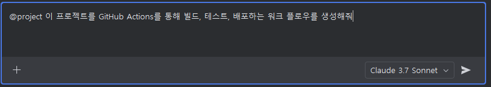
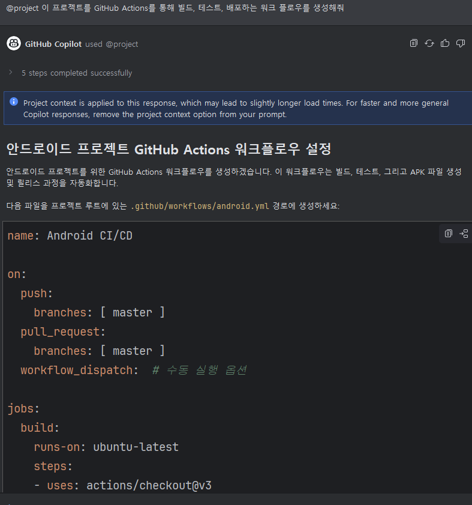

# Task 7: CI/CD 파이프라인 실습

## Use case: 
- GitHub Copilot을 사용해 GitHub Actions의 워크 플로우 생성을 실습하는 예제입니다.

## 목표:
- GitHub Copilot을 사용해 GitHub Actions workflow를 생성해보세요.

## Steps:
- 앞서 만들었던 영어 단어장 앱을 GitHub Actions를 활용해 CI/CD 파이프라인을 생성을 GitHub Copilot에게 요청합니다.
- 프롬프트 예시 : `@project 이 프로젝트를 GitHub Actions를 통해 빌드, 테스트, 배포하는 워크 플로우를 생성해줘` 
   
   

 - [android.yml](src/android.yml) 파일과 같이 생성되는 것을 확인합니다.  

