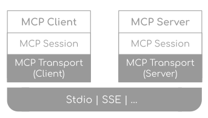
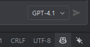
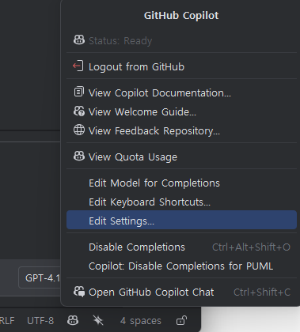
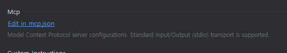
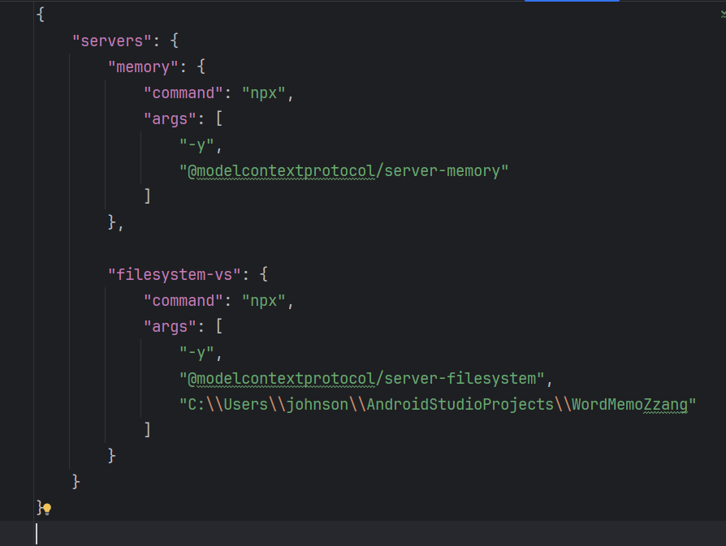
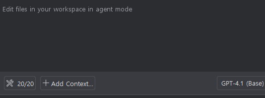
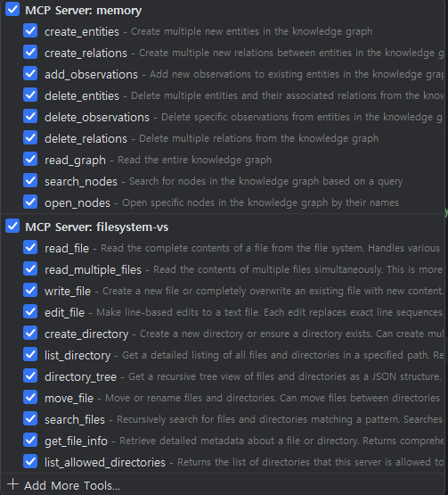
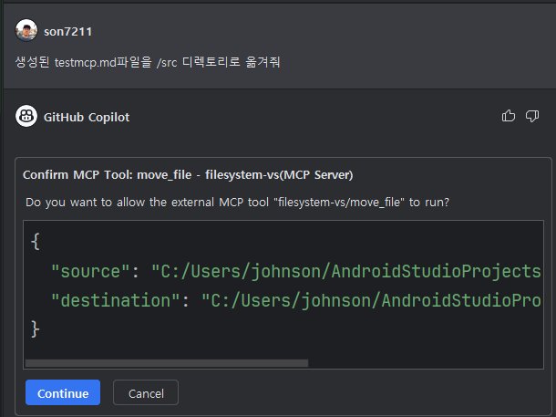
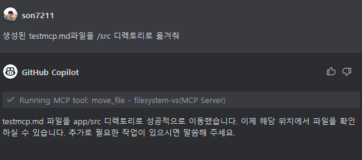
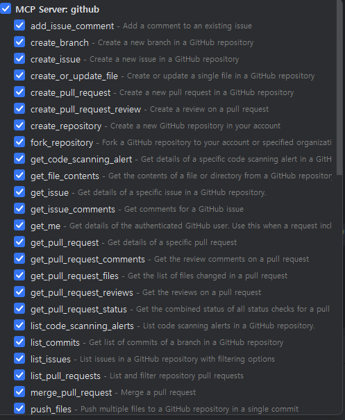

# Task 8: MCP (Model Context Protocol) 활용 실습

## Use case: 
- Android Studio에서 Model Context Protocol 서버를 설정하고, 실습하는 예제입니다.

## 목표:
- MCP (Model Context Protocol)의 기능을 이해하고, Android Studio에서 MCP 서버를 설정하여 활용하는 방법을 익힙니다.

## Step 1: MCP (Model Context Protocol) 이해하기
### MCP란? 
  - [Model Context Protocol(MCP)](https://modelcontextprotocol.io/introduction)는 AI 모델이 외부 도구, 애플리케이션, 데이터 소스를 탐색하고 상호작용할 수 있도록 표준화된 방법을 제공합니다. VS Code에서 에이전트 모드로 언어 모델에 채팅 프롬프트를 입력하면, 모델은 파일 작업, 데이터베이스 접근, API 호출 등 다양한 도구를 호출하여 요청에 응답할 수 있습니다.
  - [MCP Specification](https://modelcontextprotocol.io/specification/2025-03-26) 

### MCP 구조 : 클라이언트 - 서버 구조
  - MCP clients (like VS Code) connect to MCP servers and request actions on behalf of the AI model
  - MCP servers provide one or more tools that expose specific functionalities through a well-defined interface
  - The Model Context Protocol (MCP) defines the message format for communication between clients and servers, including tool discovery, invocation, and response handling
   <br>
   <br>

### MCP서버의 기능
  - [MCP서버는 아래 3가지 기능을 제공](https://modelcontextprotocol.io/specification/2025-03-26#features)합니다. 
  - Resources: Context and data, for the user or the AI model to use
  - Prompts: Templated messages and workflows for users
  - Tools: Functions for the AI model to execute

### MCP 개발 SDKs
  - [java](https://modelcontextprotocol.io/sdk/java/mcp-overview/)
  - [python-sdk](https://github.com/modelcontextprotocol/python-sdk)

### MCP 서버의 예시
  - [MCP 서버 예시](https://mcpservers.org/) 
  - [MCP server repository](https://github.com/modelcontextprotocol/servers) <br>
  
  에서 다양한 MCP 서버를 확인할 수 있습니다.


## Step 2: 안드로이드 스튜디오에서 테스트 MCP 서버 설정 (npm 패키지 설치)

- [안드로이드 스튜디오에서 MCP 서버설정: GitHub도움말](https://docs.github.com/en/enterprise-cloud@latest/copilot/customizing-copilot/extending-copilot-chat-with-mcp?tool=jetbrains)을 참고하여, MCP 서버를 설정합니다.

- 먼저, 안드로이드 스튜디오 우측 하단의 GitHub Copilot 아이콘을 클릭하고, 'Edit Settings'를 선택합니다. 
   <br>
   <br>

- 'Edit in mcp.json'을 선택하고, 아래과 같이 예시 MCP 서버를 설정합니다. 
   <br>

  - 두번째 서버인 "filesystem-vs"는 본인의 현재 작업 디렉토리로로 변경합니다.
	```json
	{
	"servers": {
		"memory": {
		"command": "npx",
		"args": [
			"-y",
			"@modelcontextprotocol/server-memory"
		  ]
		}, 

		 "filesystem-vs": {
            "command": "npx",
            "args": [
                "-y",
                "@modelcontextprotocol/server-filesystem",
                "C:\Users\johnson\AndroidStudioProjects\WordMemoZzang"
            ]
        }
	  }
	}
	```
   <br>
- 안드로이드 스튜디오를 재시작 합니다. 


## Step 3: MCP 서버 테스트

- 안드로이드 스튜디오가 재시작 되면, Agent모드 채팅 창 하단에 공구 모양을 클릭하여 설정된 기능을 확인합니다. 
  <br>
  <br>

- 'filesystem-vs'를 테스트 하기 위해 Agent 모드에서 아래와 같이 실행해 봅니다. 
  - `testmcp.md라는 이름으로 새로운 파일을 생성해줘`
  - `생성된 `testmcp.md`파일을 `/src` 디렉토리로 옮겨줘` --> MCP tool이 실행됩니다. 
   <br>
   <br>

## Step 4: Stdio MCP 서버 설정
- https://github.com/modelcontextprotocol/python-sdk 의 파이썬 예제를 구성하고 stdio MCP 서버를 설정해 봅니다. 
- uv 매니져 설치
  - https://docs.astral.sh/uv/#installation
- uv 프로젝트 시작
  - `uv init mcp-server-demo`
  - `cd mcp-server-demo` 로 이동
- MCP 서버 설치
  - `uv add "mcp[cli]"`

- server.py 파일을 생성하고 아래와 같이 작성합니다. 
	```python
	# server.py
	from mcp.server.fastmcp import FastMCP

	# Create an MCP server
	mcp = FastMCP("Demo")


	# Add an addition tool
	@mcp.tool()
	def add(a: int, b: int) -> int:
		"""Add two numbers"""
		return a + b

	if __name__ == "__main__":
		mcp.run()
	```

- 안드로이드 스튜디오의 `mcp.json` 파일에 아래와 같이 추가합니다. 
	```json
	
		"mcp-stdio-python": {
			"type": "stdio",
            "command": "uv",
            "args": [
                "run",
                "C:\패스\server.py"
            ]
        }
	
	```


- 안드로이드 스튜디오 Agent모드의 MCP Tool에 도구가 추가된 것을 확인합니다. 

## Step 5: Docker 형태의 MCP 서버 설정 (GitHub MCP server)
 - https://github.com/github/github-mcp-server 저장소의 GitHub MCP 서버를 Docker 형태로 설정합니다.
 - 이 MCP 서버는 사용자 랩탑에 Docker 엔진이 실행되고 있어야 합니다. 
 - 저장소 Readme 파일의 Installation 부분에 있는 설정 방법을 `mcp.json` 파일에 추가하여 tool이 추가되는 것을 확인합니다. 
   ```json
	"inputs": [
			{
			"type": "promptString",
			"id": "github_token",
			"description": "GitHub Personal Access Token",
			"password": true
			}
		],
		"servers": {
			"github": {
				"command": "docker",
				"args": [
				"run",
				"-i",
				"--rm",
				"-e",
				"GITHUB_PERSONAL_ACCESS_TOKEN",
				"ghcr.io/github/github-mcp-server"
				],
				"env": {
				"GITHUB_PERSONAL_ACCESS_TOKEN": "${input:github_token}"
				}
			}
		}

	```

 <br>


## 지식 확인
- MCP의 구조와 기능, 연결 방법은 어떤 것들이 있습니까?
- MCP 서버의 예제들은 어떤 것들이 있습니까?
